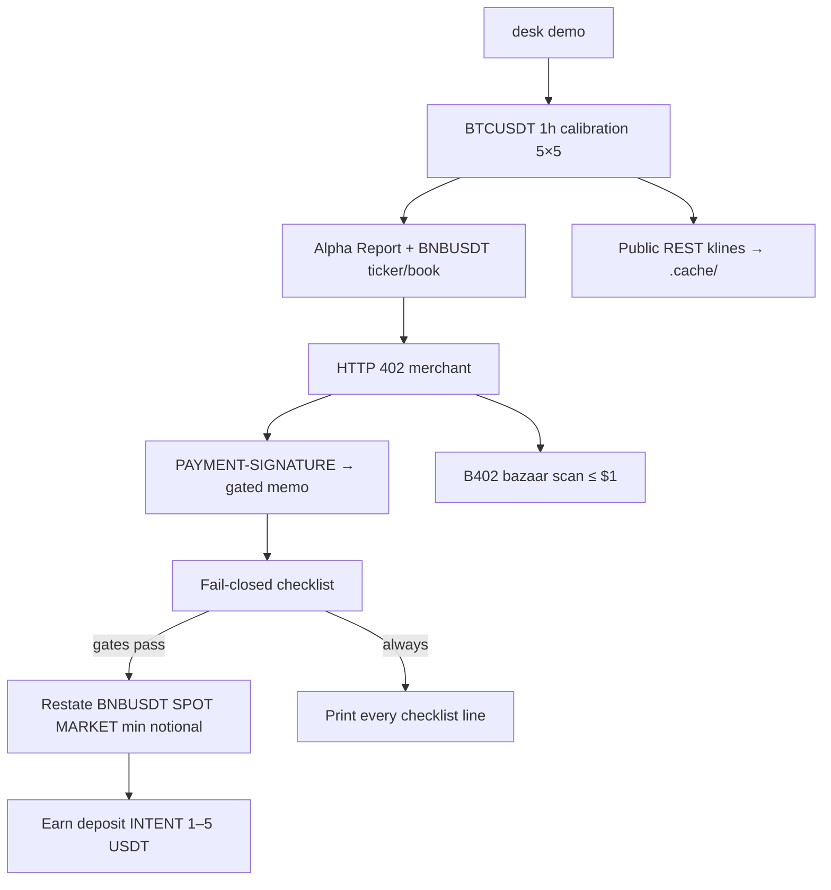

# Desk

**Desk** (`@desk/agent`) is a confirm-first TypeScript agent for the Binance Agent OS Mini Hackathon **Track A** ($20,000 USDC). The judge path is one commerce loop — research nickname **ScoutPay** (the package is still Desk):

**BTC calibration panel → pay another agent for a gated memo (HTTP 402) → min-notional BNBUSDT SPOT MARKET ticket → leftover USDT as a DeFi Earn deposit intent.**

Fail-closed checklist. Three separate confirms (`--confirm-pay`, `--confirm-spot`, `--confirm-defi`). Confirms are never skipped. Dry-run by default.

Judges: `npm install && npm run demo` — no Binance login, no API keys, under two minutes. Node 22, no Python.

Binance's public name for this stack is **Agent Native / Binance MCP Server**. "Agent OS" is the tweet / campaign branding. This repo uses both.

| Surface | Link |
|---|---|
| Agent Native MCP docs | https://developers.binance.com/en/docs/agent-native/mcp-server/agentic |
| MCP endpoint (streamable HTTP, OAuth, no API keys) | https://agent.binance.com/mcp/agentic |
| Skills Hub | https://github.com/binance/binance-skills-hub |
| B402 bazaar (public) | `https://www.binance.com/bapi/ramp/v1/public/ramp/b402/bazaar/{resources,search,merchant}` |

Connect a client: [CONNECT.md](./CONNECT.md). Film: [DEMO.md](./DEMO.md).

## Quickstart

Requires **Node 22+**.

```bash
npm install
npm run demo
```

CLI commands are entry points into the **same** loop:

```bash
npx desk brief          # BTC calibration heatmap + BNBUSDT ticker
npx desk pay            # 402 → PAYMENT-SIGNATURE → gated memo
npx desk signal         # restated min-notional SPOT MARKET ticket
npx desk chain          # DeFi Earn deposit INTENT
npx desk mcp-status     # MCP env/tools present?
```

`npm test`, `npm run build`, and `npm run lint` are wired for CI.

## Why this maps to Track A

Judges should see a **commerce loop**, not four disconnected modules. Desk reads a live BTC model-calibration panel, buys research from a counterparty agent, then only if the checklist passes does it restate a min-notional major-pair spot buy and park leftover USDT as an Earn intent.

The **dry-run trade pair stays BNBUSDT**. Calibration is BTC (the screenshot 标的). We did not switch the ticket to BTCUSDT — BNB is the treasury print; BTC is the Data diagnostic.

| Track A category | Where it lives | What `desk demo` does |
|---|---|---|
| Data & Analysis | `src/calibration/` | Live **BTCUSDT 1h** calibration dashboard: 5×5 grids of consecutive-future bars (rows H=1–5 根) vs lookback (cols L=1–5 根). Cells show predicted% → realized%, 偏差 in 点, N, bilingual status. Families: 广义加性逻辑模型, 高斯朴素贝叶斯, 梯度提升树, plus a 4根/5根 baseline strip. Public REST klines, cached under `.cache/`. Not a reverse-engineer of anyone's production weights |
| Payment Workflows | `src/payments/merchant.ts` | Agent-to-agent **x402 v2** merchant. HTTP 402 → `PAYMENT-SIGNATURE` → gated Alpha Memo. Cap **$0.25** (≤ $1, well under the $20/day x402 wallet cap). Public B402 bazaar is scanned for ≤ $1 listings; without a partner settle key the **in-repo merchant** is the demo rail |
| Trading Workflows | `src/workflows/trading.ts` | **Only if research gates pass:** restated **BNBUSDT SPOT MARKET buy** at **exchangeInfo min notional** (5 USDT observed 2026-09-01; queried, not hardcoded). DRY-RUN. Live needs `DESK_LIVE=1` **and** `--confirm-spot` **and** a bound MCP trade tool |
| Onchain Workflows | `src/skills/hub.ts` | Park leftover **1–5 USDT** as a **DeFi Earn deposit INTENT** (`baw defi preview` shape). Dry-run unless the wallet skill is actually present — still not broadcast in this repo |

**Track B** is a **separate first-10k race** (spot + futures + convert, ~80 USDT in the Agentic sub, $40k USDC prize). This repo does **not** execute Track B trades. See [CONNECT.md](./CONNECT.md) and [DEMO.md](./DEMO.md).

## BTC calibration (Data)

Event, walk-forward, and status rules are the contract for the panel. Desk does **not** claim these are the screenshot vendor's exact models — only the same *families* and the same *diagnostic layout*.

| | |
|---|---|
| Symbol | `BTCUSDT` (标的 BTC) |
| Interval | `1h` (default; documented) |
| Event | `P(close[t+H] > close[t])` for H ∈ {1,2,3,4,5} future bars |
| Features | From L ∈ {1,2,3,4,5} lookback bars: return, high-low range / close, log-return vol |
| Split | Expanding / rolling walk-forward so every cell is **out-of-sample** |
| Models | GAM-style logistic (spline / bucketed features, pure TypeScript IRLS); Gaussian naive Bayes (online); small histogram GBDT. Plus a causal rolling-up-frequency **baseline** on H=4,5 |
| Cache | `.cache/klines-BTCUSDT-1h.json` (gitignored). First fetch hits public REST; later demos reuse it |
| Artifacts | `artifacts/btc-calibration.md` and `artifacts/btc-calibration.json` written by `desk demo` / `desk brief` |

**Status thresholds** (偏差 = realized% − predicted%, in 点):

| Rule | Label |
|---|---|
| N = 0 | 无样本 / no sample |
| \|bias\| < 3pt **and** N ≥ 30 | 基本靠谱 / basically reliable (green) |
| \|bias\| < 6pt otherwise | 吻合但没优势 / agreement but no edge (yellow) |
| predicted exceeds realized by ≥ 6pt | 明显高估 / significantly overestimated (red) |
| realized exceeds predicted by ≥ 6pt | 明显低估 / significantly underestimated (blue) |

Selected model = the one with the most 基本靠谱 cells (ties prefer GBDT, as in the screenshot's 19/25). Fail-closed ScoutPay gate: selected model's **short-horizon** cells (H=1–2 × L=1–5) must not be majority 明显高估.

## Architecture



```
src/
  cli.ts                 desk demo | brief | pay | signal | chain | mcp-status
  calibration/           BTC 5×5 walk-forward panel (status, GAM, GNB, GBDT)
  workflows/demo.ts      ScoutPay loop (sequential)
  workflows/data.ts      Alpha Report + calibration
  workflows/trading.ts   min-notional SPOT BUY
  workflows/payments.ts  x402 merchant + bazaar scan
  workflows/onchain.ts   Earn deposit intent
  checklist.ts           fail-closed, print every line
  payments/merchant.ts   ~20-line x402 v2 demo merchant
  mcp/client.ts          capability bind — no invented tool names
```

`BinanceMcpClient` never hard-codes MCP tool names. Missing OAuth does not crash the demo.

## Checklist (fail closed)

Printed on every `desk demo`. A missing confirm is a **fail**, never an implicit yes. Bare `--confirm` is ignored.

- major CEX pair only (default BNBUSDT) — no meme live orders
- audit not HIGH / not honeypot
- ticker+24h returned
- BTC calibration not majority 明显高估 on short horizon (H=1–2)
- (live path) Spot USDT ≥ min notional + fees on the **Agentic sub**
- x402 `amountUsd ≤ 1.00` and `READY_TO_SIGN`
- three separate confirms: pay, spot, defi

If later gates fail, Desk still shows the Alpha Report / heatmap and the 402 receipt/memo when payment happened.

## Risk notes

- **Not financial advice.** Calibration is a diagnostic, not a trade signal.
- **Dry-run default.** Live send requires `DESK_LIVE=1` **and** `--confirm-spot` **and** a bound trade tool. This repo still refuses to invent a tool name.
- **No withdrawals, ever.** Agentic virtual sub only. The agent cannot pull from main.
- **No mainnet money movement** in this demo. x402 is the in-repo merchant on chain 97. Earn is an intent.
- Sub-account funding is the max loss. Confirm-first is a pause, not a cap.

## License

MIT. See [LICENSE](./LICENSE).
