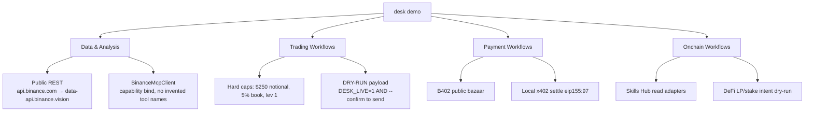

# Desk

**Desk** is a confirm-first TypeScript agent for the Binance Agent OS Mini Hackathon **Track A** ($20,000 USDC). It is one desk that chains four workflow categories in a single blotter:

1. **Data & Analysis** — live public market briefing (reports, market analysis, portfolio insights)
2. **Trading Workflows** — funding + book-imbalance mean-reversion signal, dry-run executor
3. **Payment Workflows** — agent-to-agent B402 / x402 receipt (public bazaar + local mock settlement)
4. **Onchain Workflows** — Skills Hub adapters, token inspect, BSC testnet LP/stake intent (dry-run)

Judges: `npm install && npm run demo` — no Binance login, no API keys, under two minutes.

Binance's public name for this stack is **Agent Native / Binance MCP Server**. "Agent OS" is the tweet / campaign branding. This repo uses both.

| Surface | Link |
|---|---|
| Agent Native MCP docs | https://developers.binance.com/en/docs/agent-native/mcp-server/agentic |
| MCP endpoint (streamable HTTP, OAuth, no API keys) | https://agent.binance.com/mcp/agentic |
| Skills Hub | https://github.com/binance/binance-skills-hub |
| B402 bazaar (public) | `https://www.binance.com/bapi/ramp/v1/public/ramp/b402/bazaar/{resources,search,merchant}` |

Connect a client: see [CONNECT.md](./CONNECT.md). Film the demo: see [DEMO.md](./DEMO.md).

## Quickstart

Requires **Node 22+**.

```bash
npm install
npm run demo
```

Individual commands:

```bash
npx desk brief          # Data & Analysis
npx desk signal         # Trading signal + dry-run MCP payload
npx desk pay            # Desk ↔ Counterparty B402/x402 trace
npx desk chain          # Token inspect + DeFi intent
npx desk mcp-status     # MCP env/tools present?
```

`npm test`, `npm run build`, and `npm run lint` are wired for CI.

## Why this maps to Track A

The product is not a dashboard of fake charts. It is a **desk blotter**: analysis writes a market row, the row feeds a risk-capped signal, the signal is notarized by a counterparty agent over B402, and only then does Desk propose an onchain DeFi intent. Every write is confirm-first. The default path never sends a live order and never moves mainnet money.

| Track A category | Desk module | What the demo actually does |
|---|---|---|
| Data & Analysis | `src/workflows/data.ts` | BTCUSDT + ETHUSDT + SOLUSDT: last, 24h, book imbalance, 24×1h klines, funding, S/R, sample-book insights |
| Trading Workflows | `src/workflows/trading.ts` | Structured `Signal {symbol, side, confidence, rationale, suggestedSize}`. Dry-run MCP trade payload |
| Payment Workflows | `src/workflows/payments.ts` | Discover B402 bazaar → HTTP 402 → local x402 mock settle on BSC testnet 97 → receipt |
| Onchain Workflows | `src/workflows/onchain.ts` | `query-token-info` / `query-token-audit` adapters + `baw defi preview` intent, dry-run unless the wallet skill is installed (still not executed here) |

**Track B** (Connect to MCP: spot + futures + margin/convert, $40k USDC) is a follow-up once OAuth is connected. This repo does **not** execute live trades. See [DEMO.md](./DEMO.md).

## Architecture



```
src/
  cli.ts                 desk demo | brief | signal | pay | chain | mcp-status
  workflows/data.ts      live briefing
  workflows/trading.ts   Signal + executor
  workflows/payments.ts  B402 / x402
  workflows/onchain.ts   Skills Hub + DeFi intent
  mcp/client.ts          BinanceMcpClient
  market/rest.ts         public REST with geo-block fallback
  payments/bazaar.ts     bazaar envelope + mock settlement
  skills/hub.ts          subprocess or HTTP adapters
skills/desk/SKILL.md     skill pack for Claude Code / Codex / etc.
```

`BinanceMcpClient` never hard-codes MCP tool names (Binance does not publish them). It probes `tools/list` after OAuth and binds by capability (`market` / `account` / `trade` / `transfer`). If MCP is missing, **the demo still runs** on public REST.

Market data is public and needs no auth: tickers, order books, candlesticks, funding, 24h change. Account / trade / transfer require Binance OAuth and an auto-created **Agentic virtual sub** account. The agent cannot withdraw and cannot pull funds from the main account. Writes are confirm-before-execute.

Trading surface when authorized: spot, margin, convert, USDⓈ-M and COIN-M futures, intra-sub-account transfers. Desk's default venue is **spot**, size-capped, leverage 1.

## Payments (B402 / x402)

- Live B402 facilitator is documented on **BSC Testnet chain 97**.
- Public bazaar: `GET {base}/bazaar/resources|search|merchant` with envelope `{code,message,messageDetail,data,success}`.
- Authenticated ` /papi/v2/b402/{supported,verify,settle}` needs partner credentials we do **not** have. Desk does not apply to the partner form.
- The demo discovers a real bazaar resource, constructs an x402 `PaymentRequired`, remaps settlement to `eip155:97`, and completes a **local mock** so judges never need a merchant key.

## Onchain (Skills Hub)

```bash
npx skills add https://github.com/binance/binance-skills-hub
```

Published `binance-web3` skills this adapter knows about:

- write: `binance-agentic-wallet` (wallet, transfers, swaps, limit orders on BSC / ETH / Base / Solana) via `baw`
- read: `query-token-info`, `query-token-audit`, `query-address-info`, `crypto-market-rank`, `meme-rush`, `trading-signal`, `binance-tokenized-securities-info`

Desk calls the same public Web3 endpoints those skills wrap when the CLI is not installed, so the demo does not depend on `npx skills add`.

## Risk notes

- **Not financial advice.** Outputs are a demo blotter, not a recommendation to buy, sell, or hold anything.
- **Dry-run default.** The executor prints an MCP-shaped trade payload. It sends only if `DESK_LIVE=1` **and** `--confirm` **and** a trade tool is actually bound. This repo still refuses to send if MCP is unbound.
- **No withdrawals, ever.** Even with MCP connected, the Agentic sub cannot withdraw and cannot pull from the main account.
- **No mainnet money movement** in this demo. B402 settlement is a local mock on chain 97. DeFi intents are dry-run.
- Do not fund an Agentic sub with more than you can lose. Confirm-first is a pause, not a max-loss.

## License

MIT. See [LICENSE](./LICENSE).
